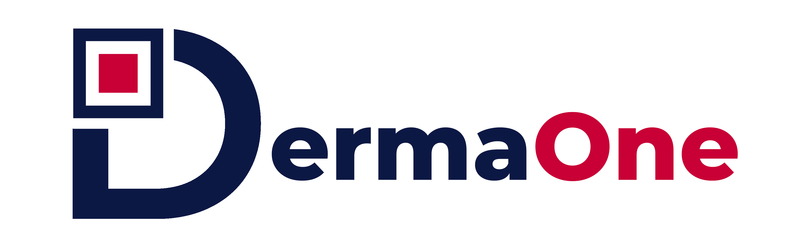

A mobile application to assist users in identifying skin diseases using machine learning and cloud computing. Built as part of the Bangkit Academy program (Google, Tokopedia, Gojek, Traveloka).

---

## Table of Contents
- [About the Project](#about-the-project)
- [Learning Paths](#learning-paths)
  - [Machine Learning](#machine-learning)
  - [Cloud Computing](#cloud-computing)
  - [Mobile Development](#mobile-development)
- [Features](#features)
- [Usage](#usage)

---

## About the Project
DermaOne utilizes machine learning for image-based skin disease detection and cloud services to enhance accessibility. It also provides educational resources about detected diseases and maintains a history of user predictions.

---

## Learning Paths

### Machine Learning
- Dataset: 1,159 images, 8 skin disease classes (e.g., cellulitis, impetigo).
- Model: CNN with TensorFlow, utilizing normalization, augmentation, and Adam optimization.
- Results: Visualized metrics for accuracy and performance evaluation.

### Cloud Computing
- **Google Cloud Platform**: Used for cost monitoring, authentication, and resource storage.
- **Storage Buckets**: For image uploads and prediction results.
- **Cloud Run**: Hosts APIs for disease prediction and news features.

### Mobile Development
- **Android Studio**: Kotlin-based app with seamless integration of machine learning and cloud services.
- Features: Google Sign-In, image upload for disease prediction, health news, and prediction history.

---

## Features

1. **Skin Disease Detection**: 
   - Upload images via camera or gallery.
   - Obtain predictions with confidence scores.
2. **Health Information**:
   - Fetch and display news articles via NewsAPI.
3. **Prediction History**:
   - Store and review past predictions.
4. **Authentication**:
   - Email/password and Google OAuth login options.
5. **User-Friendly Navigation**:
   - Dashboard, Information Health, History, and Profile sections.

---

## Usage

 
    
    
    
    
    

---

Built with passion by the DermaOne team.
